<!-- 如果要设置图片大小什么的，尽量去设置宽度而不是高度，因为你设置的高度会被CSS的 height: auto 覆盖掉；但是设置 width=60% 会导致编译失败，一定要写 width="60%" -->

---

# ⚽Football

    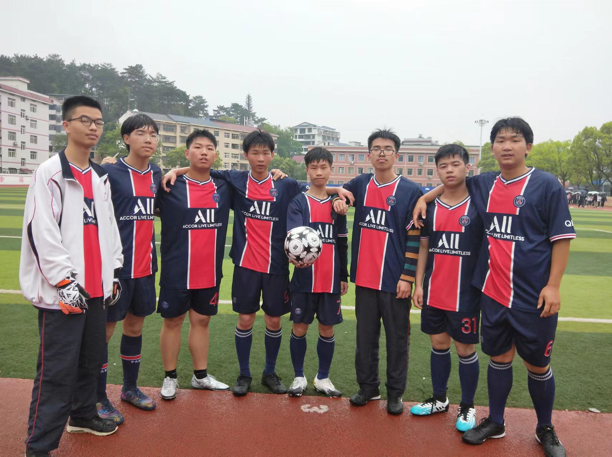
     
    

        won a football match, with my teammate, autumn 2021
    

    
 

    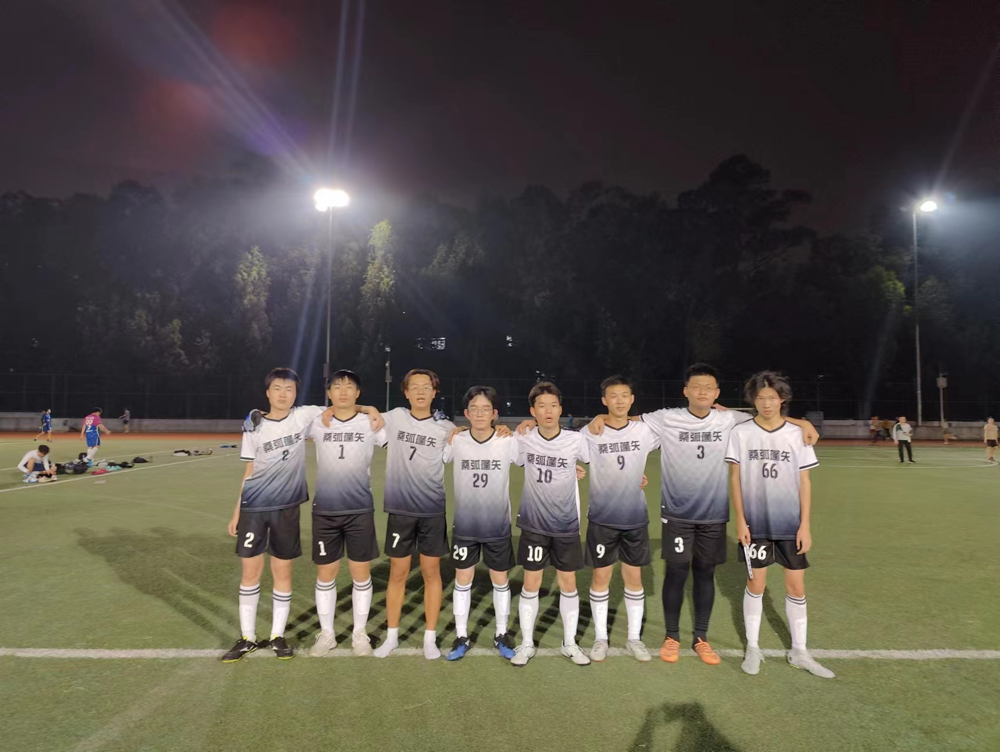
     
    

        mark the unforgettable moment, spring 2023
    

    
 

# 🌏Travel

    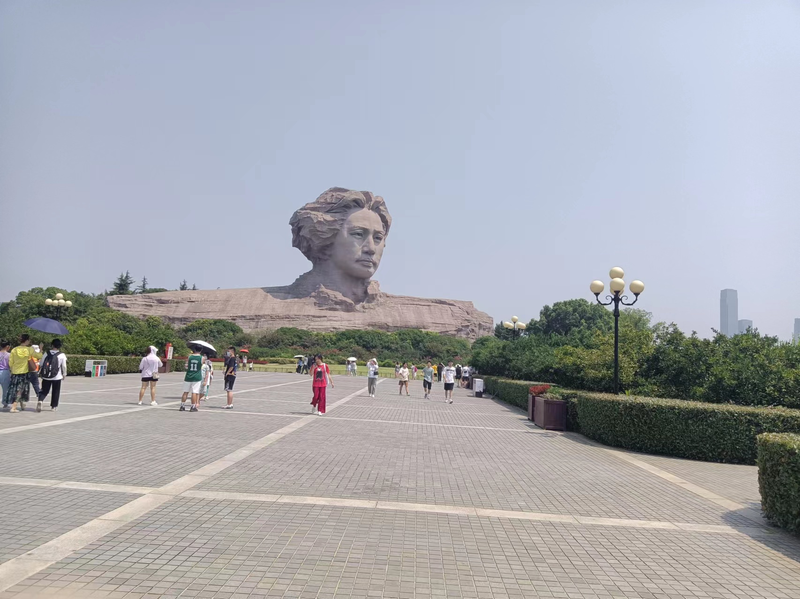
    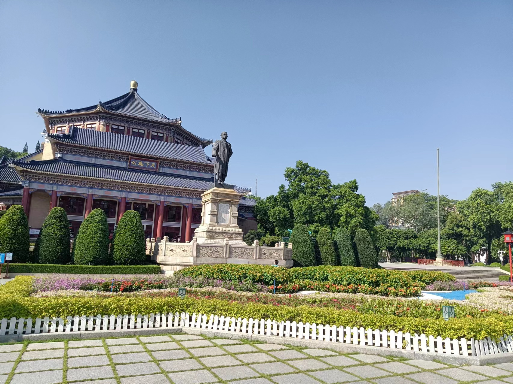
     
    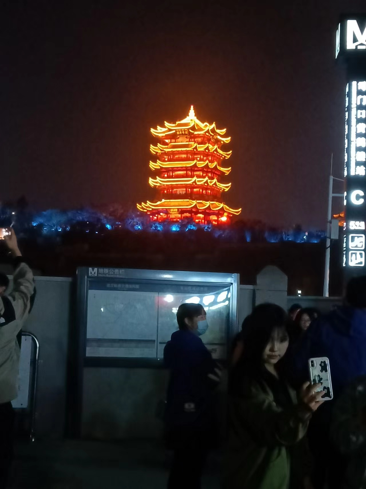
    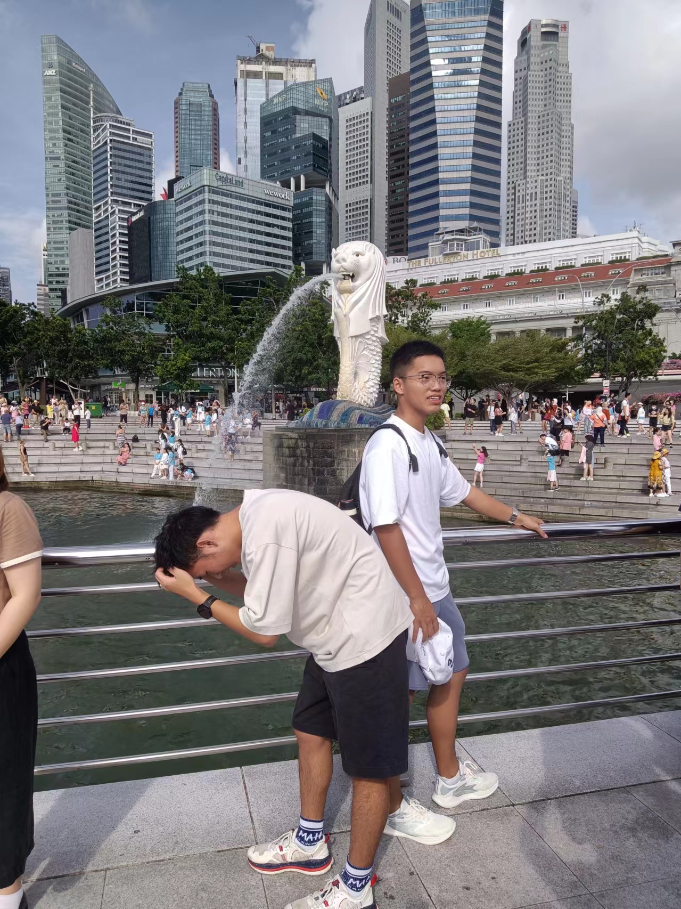
     
    

    

    travel around
    
 

# 🛩️Model Airplanes

    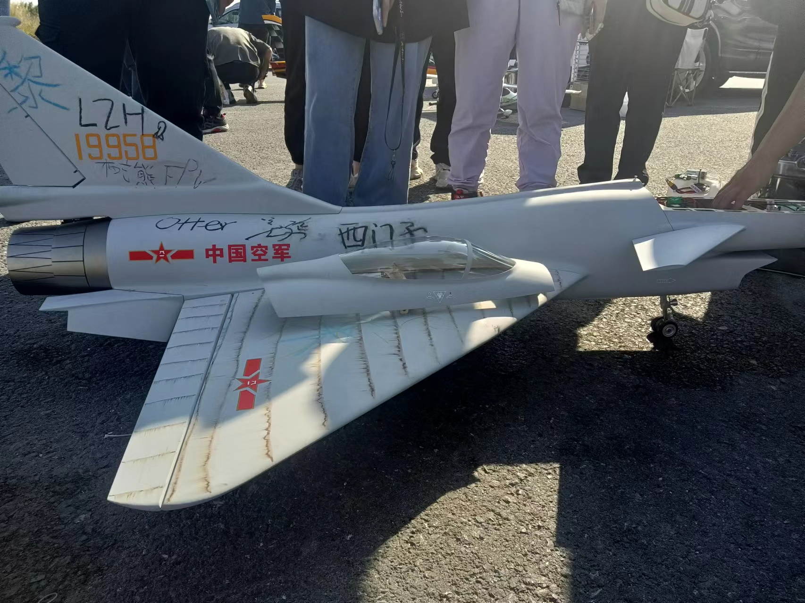
    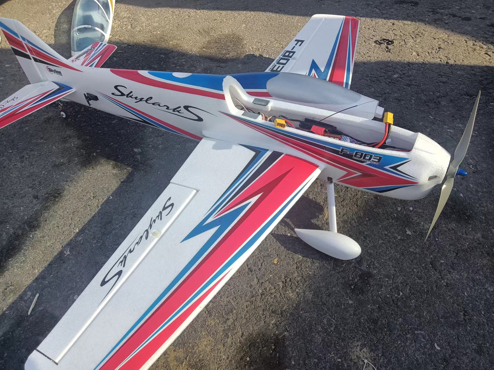
     
    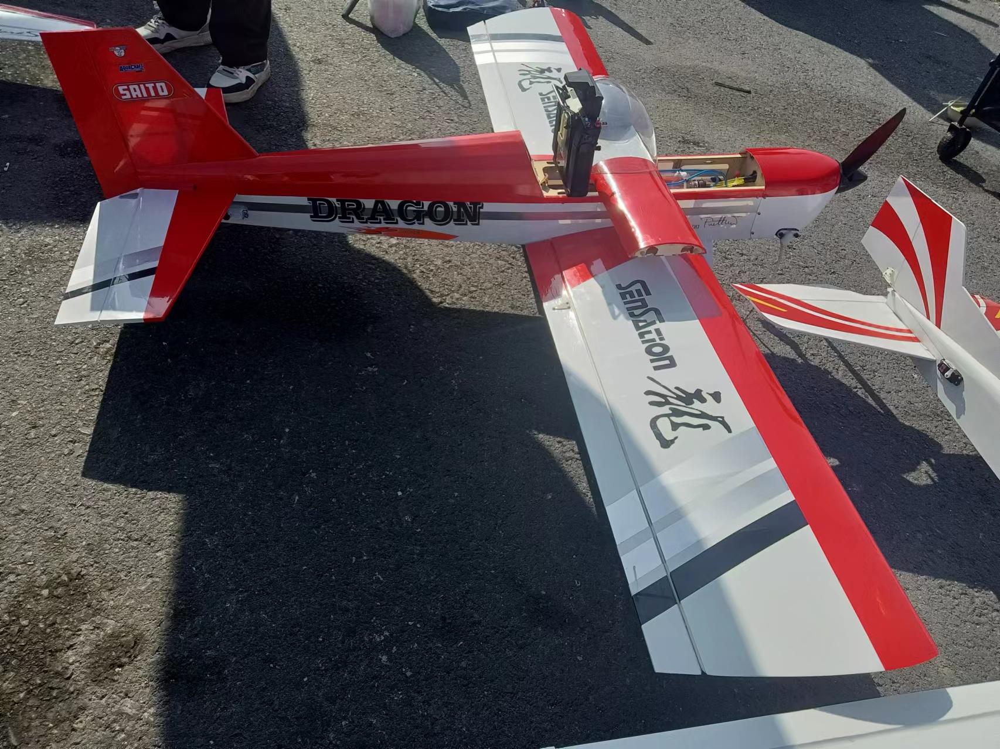
    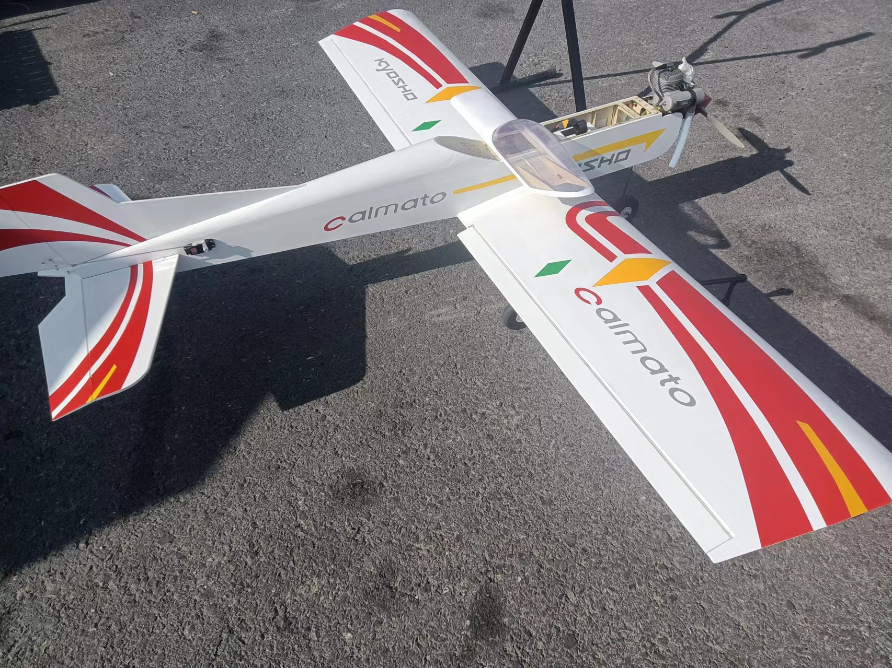
     
    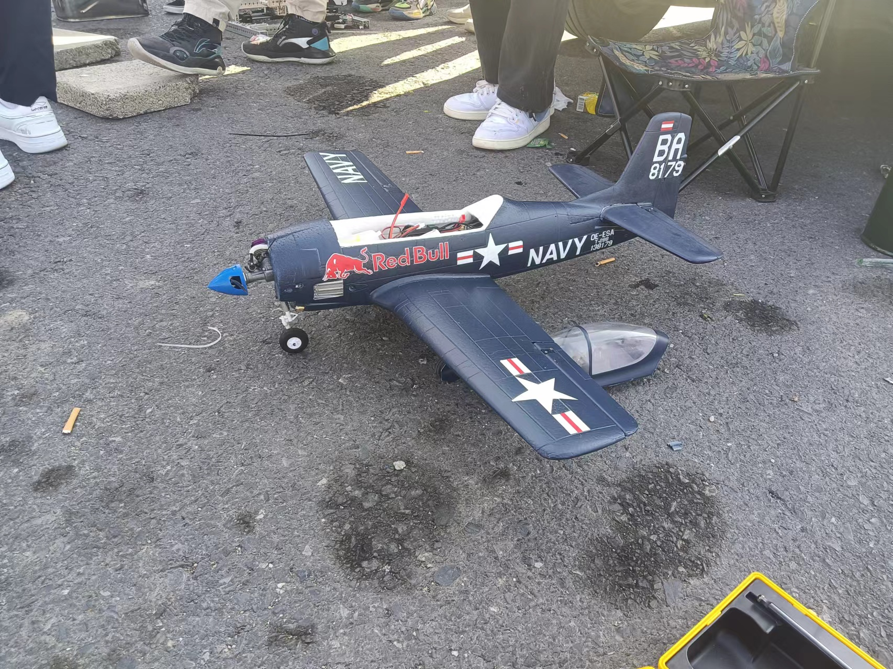
    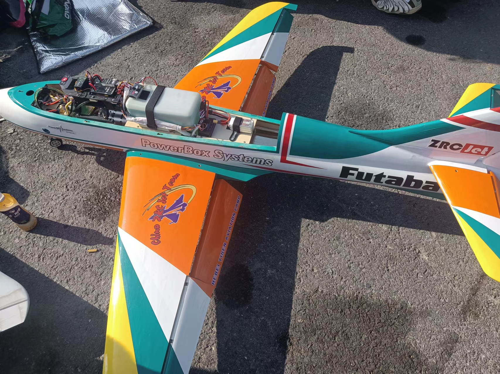
     
    

        powerful model planes, spring 2024
    

    
 

<head>
<!-- Google tag (gtag.js) -->

</head>