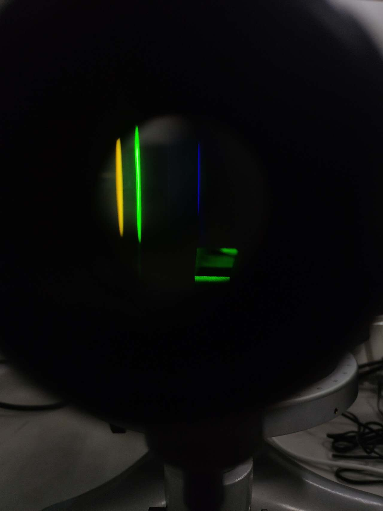

<!-- -->
---

# 👨‍🎓About

I am a Junior student in the Division of Automation at South China University of Technology(SCUT). My research interests broadly lie in Computer Vision, Efficient ML and GenAI. To study further, I am seeking an opportunity to intern at place I am interested in, or collaborate with others. If it does come, I will not waste it because I know it comes not easy.  

Outside of my academic life, I enjoy hiking, jogging and playing football a lot. I grew up in Hengyang, a centuried city in Hunan province, China.

<!-- Please find my CV [here](../files/周浩+19958985988.pdf "Hao Zhou's CV"){:target="_blank"}. -->

# 🎓Education 

- 09/2022 ~ Present:  [School of Automation Science and Engineering](https://www2.scut.edu.cn/automation/ "SCUT, AU"){:target="_blank"},  [South China University of Technology](https://www.scut.edu.cn/ "SCUT"){:target="_blank"} 
    - Sophomore in *Automation* 
    - GPA: 3.7/4.0
    - Selected Course: Calculus I,II(4.0, 4.0)/4.0, Linear Algebra(4.0/4.0), Data structure and Algorithm(3.7/4.0)

# News

[09/10/2024] I get an internship at [ShangHai AI Lab](https://www.shlab.org.cn/). \
[09/02/2024] Bronze Prize in VISION 24 Data Challenge - One Shot Industrial Defect Segmentation, organized by 2nd ECCV workshop on Vision-based InduStrial InspectiON (VISION).

# 📃Articles 
  Not yet :( \
  But I am actively working on a project related to LLM, you can contact me free if you are interested :).

# 🏅Honors and Awards

- Bronze Prize, VISION 24 Data Challenge - One Shot Industrial Defect Segmentation
- Second Prize, 2023 China Undergraduate Engineering Practice And Innovation Ability Competition, Guangdong province
- Open Source Award, 2023 Intramural Robot Competition 
- Second Prize, the 3rd Hunan Youth Creative Programming and Intelligent Design Competition
- Third Prize, The 38th National Physics Competition for Middle School Students (Hunan Region)

# 🔧Skills

- Programming: Python, Matlab, C++ 
- System: Linux 
- Languages: (Mandarin) Chinese, English 

---

# 📷Gallery

    
<!--    
    
-->
    
    

---

<head>
<!-- Google tag (gtag.js) -->

</head>