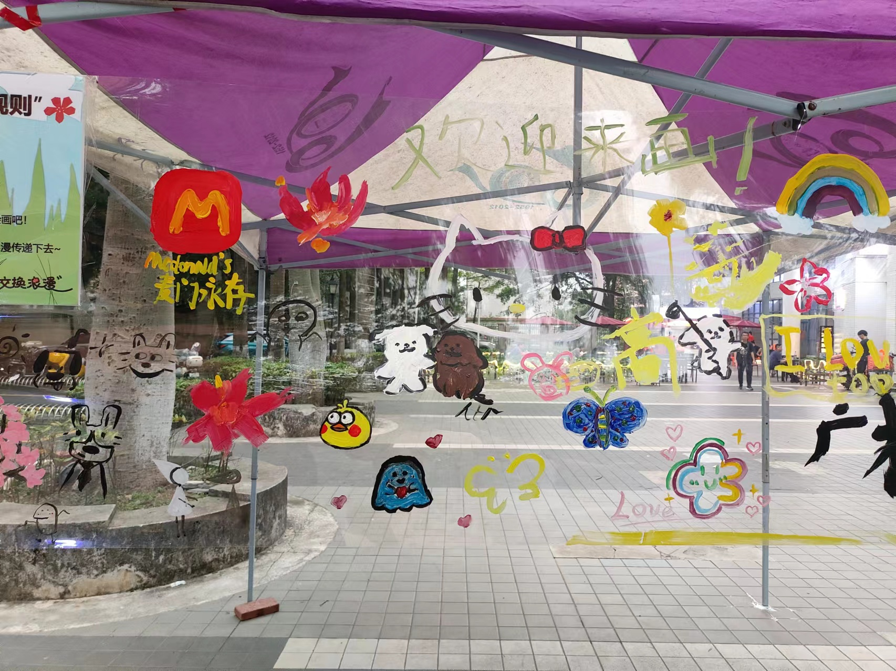
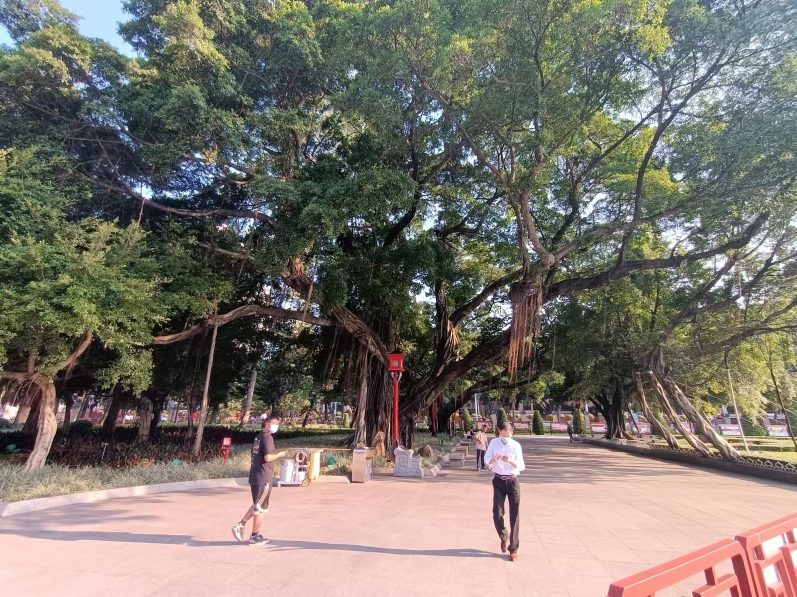

<!-- -->
---

# 👨‍🎓About

**Hao Zhou** is a Sophomore student in the Division of Automation at South China University of Technology. My research interests broadly lie in computer vision and Efficient ML, Robotics. Recently I work on a project about Gait Recognition, Knowledge Distillation and Pruning.

Outside of my academic life, I enjoy hiking, jogging and playing football a lot. I grew up in Hengyang, a centuried city in Hunan province, China.

Please find my CV [here](../files/Hao Zhou.pdf "Hao Zhou's CV"){:target="_blank"}.

# 🎓Education 

- 09/2022 ~ Present:  [School of Automation Science and Engineering](https://www2.scut.edu.cn/automation/ "SCUT, AU"){:target="_blank"},  [South China University of Technology](https://www.scut.edu.cn/ "SCUT"){:target="_blank"} 
    - Sophomore in *Automation* 
    - GPA: 3.7/4.0
    - Selected Course: Calculus I,II(4.0, 4.0)/4.0, Linear Algebra(4.0/4.0), Data structure and Algorithm(3.7/4.0)

# 📃Articles 
  Not yet :( \
  But I am actively working on a project related to Gait Recognition instructed by [Prof. Wenxiong Kang](https://yanzhao.scut.edu.cn/open/ExpertInfo.aspx?zjbh=uEEiNVSAKPm0dfrODLtrzQ==  "Prof. Wenxiong Kang"), you can contact me freely if you are interested :)

# 🏅Honors and Awards

- Second Prize, 2023 China Undergraduate Engineering Practice And Innovation Ability Competition, Guangdong province
- Open Source Award, 2023 Intramural Robot Competition 
- Second Prize, the 3rd Hunan Youth Creative Programming and Intelligent Design Competition

# 🔧Skills

- Programming: Python, Matlab, C++ 
- System: Linux 
- Languages: (Mandarin) Chinese, English 

---

# 📷Gallery

    
    
    

---

